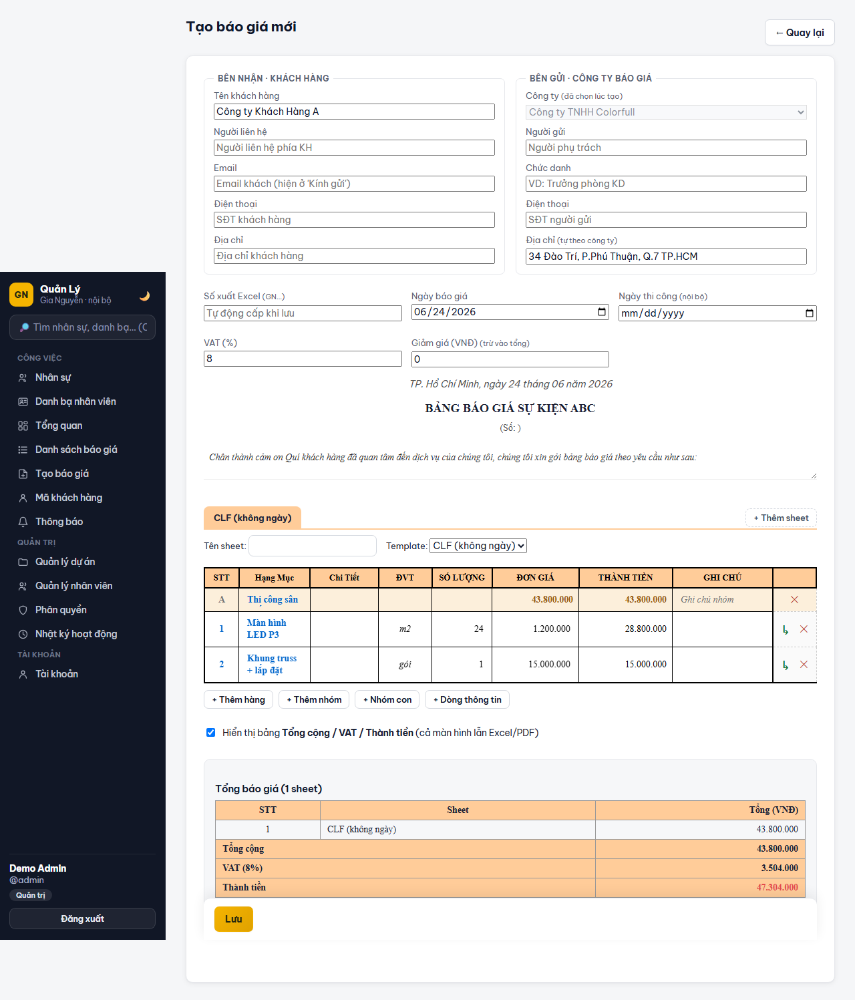

# Quản Lý Báo Giá — quotation & project management platform

An internal web application that replaced a company's Excel-file-passing
workflow for building, versioning and approving customer quotations. It is not
a demo: it is used every working day by the sales, HR and accounting staff of
two Vietnamese companies, and every quotation the business sends to a customer
comes out of it.

> *Tiếng Việt: hệ thống nội bộ quản lý báo giá + hồ sơ nhân sự + theo dõi dự án,
> xuất Excel khớp đúng mẫu công ty. Đang chạy production.*



**29 Prisma models · 137 HTTP endpoints · 86 test files**

<sub>Mọi con số ở trên được **sinh từ mã nguồn**, không đếm tay:
`node scripts/ci/repo-stats.mjs` và `node scripts/ci/endpoint-inventory.mjs`.
CI chạy cả hai với `--check`, nên số ở đây, ở
[docs/product/ROLES_PERMISSIONS.md](docs/product/ROLES_PERMISSIONS.md) và trong
code không thể trôi khỏi nhau. Con số nào không kiểm chứng được thì không được
công bố — số commit và tổng LOC đã bị bỏ vì đúng lý do đó.</sub>

---

## The two hard problems

Most line-of-business CRUD apps are not interesting. These two parts were.

### 1. Excel output has to be byte-for-byte the company's own template

Accounting would not accept "an Excel file with the same numbers" — it had to be
*their* file: same logo placement, fonts, borders, merged cells, print ranges,
across three different templates (two Gia Nguyễn variants, one Colorfull). A
generated-from-scratch workbook always looked subtly wrong.

So instead of generating workbooks, [`src/xlsxStitcher.ts`](src/xlsxStitcher.ts)
treats the real `.xlsx` templates as what they are — zip archives of XML — and
**splices rows into the template's sheet XML directly**, rewriting shared
strings, merge ranges, row spans and dimension refs, then repacking the zip. One
quotation with several sheets becomes one multi-sheet workbook, each sheet
keeping its own template's formatting. PDF export goes through PDFKit.

### 2. A spreadsheet grid in the browser that Vietnamese typists can actually use

Users came from Excel, so the quote editor is a real grid: Excel-style formulas
(`=5x3`, `=SUM(H3:H8)`, cell references like `=G3*E3`), a formula bar with
function-name hints, `Ctrl+Z/Y`, fill-down, and multi-cell selection.

The parts that took the actual work:

- **Clipboard via browser copy/cut/paste events, not keyboard shortcuts.** Key
  interception breaks on Safari, Firefox, right-click menus, touch devices, and
  Vietnamese IMEs. Using the real clipboard events means paste works everywhere,
  including over plain HTTP on the LAN.
- **An RFC-4180 paste parser** (unit-tested) so pasting multi-line Excel cells
  doesn't shred rows, and Vietnamese number formatting (`1.234`) parses as 1234.
- **Round-tripping its own export**: paste a table this app produced back into
  it, and it reconstructs the group / sub-group / sub-row / info-row hierarchy
  from the flat cells — see [`web/src/lib/clipboard.ts`](web/src/lib/clipboard.ts).
- **IME-safe editing** — pressing Enter to commit a word in OpenKey/Unikey does
  not jump the cursor to the next cell.

## Stack

| Layer | Technology |
|---|---|
| API | Node.js 22 · **TypeScript 5.7** · Express 4 · Zod 4 validation |
| Data | PostgreSQL · **Prisma 7** (29 models) · Redis (ioredis) |
| Auth | Cookie sessions + JWT access/refresh · bcrypt · TOTP 2FA (speakeasy) · role + per-user permissions |
| Realtime | Server-Sent Events ([`src/sse.ts`](src/sse.ts)) with a Redis Pub/Sub backplane |
| Background work | BullMQ workers on Redis |
| Documents | ExcelJS + custom OOXML zip stitching · PDFKit (embedded fonts) · Nodemailer |
| Storage | S3-compatible object storage (payment proofs, attachments) |
| Frontend | React 19 + Vite (`web/`) · vanilla-JS grid engine (`public/`) |
| Testing | **Vitest** (unit + integration + coverage) |
| Ops | Docker + Compose (dev / staging / prod) · **Helm chart** · pino structured logs · Prometheus metrics |
| CI | GitHub Actions — lint, typecheck, build, tests, Helm render, artifact + container smoke tests, security scans, SBOM |

Production runs a **compiled artifact** — `node dist/server.js` — and Docker,
Compose, Helm and the raw k8s manifests all start that exact same command. A CI
check ([`scripts/ci/check-runtime-command.sh`](scripts/ci/check-runtime-command.sh))
fails the build if any of them drift apart.

## Beyond quotations

The same app grew two more modules the business needed:

- **HR module** — per-project labour records and a staff directory, where
  `accountant` marks payments and `admin` confirms signed contracts.
- **Project tracking** — closed quotations laid out by sheet/invoice, with
  internal cost grids (HCM cost / Hà Nội quote / customer fees) that are
  deliberately *excluded* from customer-facing Excel output.

Quotation lifecycle is intentionally not an internal approval chain — the only
approval that matters is the customer's: `Draft → Customer confirmed / declined`.
An earlier internal review queue was removed once it proved to be ceremony.

## Running it

```bash
cp .env.example .env         # đọc kỹ: biến nào BẮT BUỘC ở production được đánh dấu rõ
npm ci
docker compose up -d postgres redis minio   # hạ tầng cho môi trường dev
npx prisma migrate deploy
npm run dev                  # API (tsx watch) — web chạy riêng: npm --prefix web run dev
npm test                     # Vitest
```

Chi tiết đầy đủ: [docs/development/SETUP.md](docs/development/SETUP.md).

## Documentation

Toàn bộ tài liệu nằm ở [`docs/`](docs/README.md). Điểm vào chính:

| Cần gì | Đọc gì |
|---|---|
| Hệ thống ghép lại thế nào | [docs/architecture/ARCHITECTURE.md](docs/architecture/ARCHITECTURE.md) |
| Mô hình bảo mật | [docs/architecture/SECURITY_MODEL.md](docs/architecture/SECURITY_MODEL.md) |
| Dựng môi trường dev | [docs/development/SETUP.md](docs/development/SETUP.md) |
| Chạy / viết test | [docs/development/TESTING.md](docs/development/TESTING.md) |
| Triển khai, phát hành, rollback | [docs/operations/DEPLOYMENT.md](docs/operations/DEPLOYMENT.md) |
| Sao lưu và khôi phục thảm hoạ | [docs/operations/DISASTER_RECOVERY.md](docs/operations/DISASTER_RECOVERY.md) |
| Có sự cố, xử lý ra sao | [docs/operations/INCIDENT_RESPONSE.md](docs/operations/INCIDENT_RESPONSE.md) |
| Tính năng nghiệp vụ | [docs/product/FEATURES.md](docs/product/FEATURES.md) |
| Ai được làm gì | [docs/product/ROLES_PERMISSIONS.md](docs/product/ROLES_PERMISSIONS.md) |
| Vì sao chọn kiến trúc này | [docs/adr/](docs/adr/) |

Tài liệu cũ (audit, benchmark, handoff) nằm ở [`docs/archive/`](docs/archive/) —
giữ lại vì chúng ghi lại *vì sao* hệ thống thành ra như hiện nay, nhưng nhiều
phát hiện trong đó đã được sửa. **Nguồn sự thật luôn là mã nguồn.**

## Contributing

Xem [AGENTS.md](AGENTS.md) — quy ước mã nguồn, chốt chặn của CI, và những thứ
tuyệt đối không được phá (Excel round-trip, clipboard, IME tiếng Việt).

## License

Published publicly as a work sample. This is internal business software; it
carries no open-source license and is not intended for reuse. All rights
reserved.
