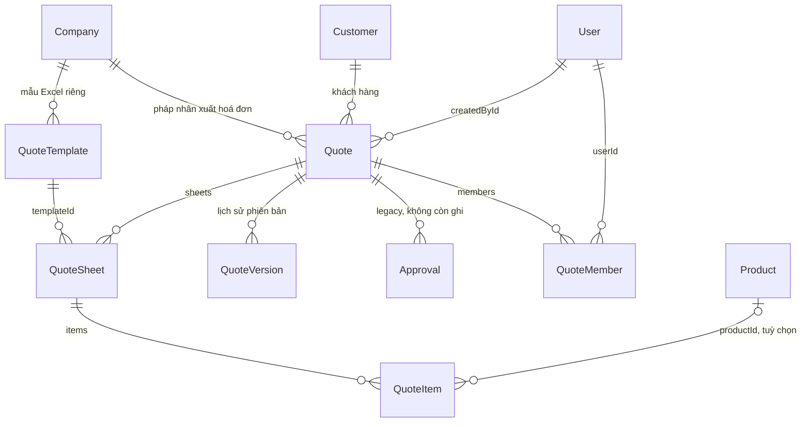
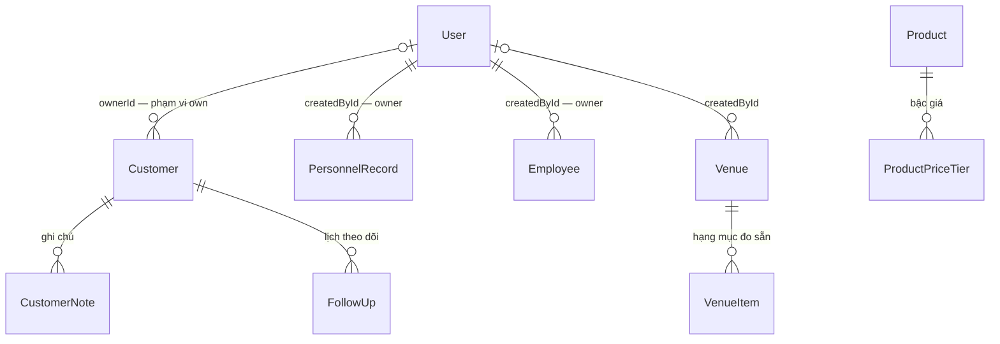
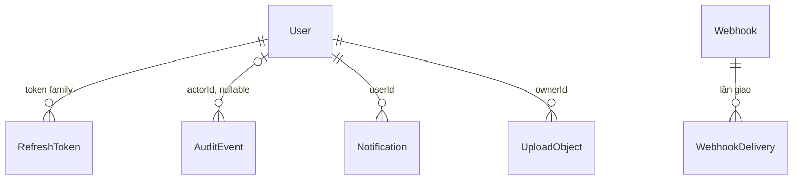
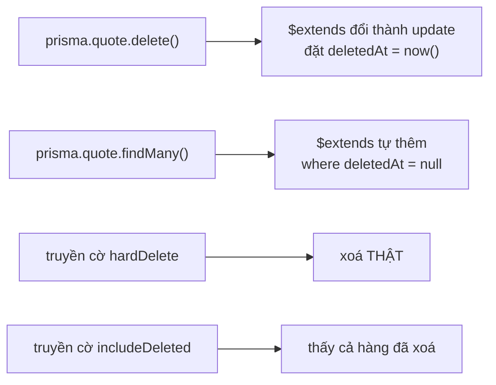

# Mô hình dữ liệu

Nguồn duy nhất: `prisma/schema.prisma`. Bảng dưới đây vẽ **quan hệ**, không vẽ
đủ cột — cột thì đọc schema, và schema có chú thích tiếng Việt cho gần như mọi
cột lạ. Giải thích index, migration và drift được phép:
[DATABASE.md](../../development/DATABASE.md).

## Lõi báo giá

Sáu điều mà sơ đồ **không** nói ra được, và đều quan trọng:

* **`QuoteSheet.extraTables` là JSON, không phải bảng.** Bảng nội bộ theo trang
  (`category` là `"hcm"` / `"khach"`) sống trong một cột `Json?`. Đó là lý do mọi
  đường ghi nó đều là **read-modify-write nguyên khối** và phải lấy khoá
  `FOR UPDATE` — xem [quote-save.md](quote-save.md).
* **Bảng Hà Nội KHÔNG nằm ở đó nữa.** Từ 2026-09-15 nó là `Quote.hnTables`, một
  cột `Json?` ở **cấp báo giá**. Lý do: account Hà Nội cần không gian riêng,
  không lặp theo trang của chủ (lộ số trang + tên trang), và mỗi lần chủ bấm Lưu
  là toàn bộ `QuoteSheet.id` đổi (lưu = xoá trang rồi tạo lại) nên mọi thứ ghim
  theo `sheetId` đều chết. Migration là **expand-only**: bản cũ còn nguyên trong
  `extraTables` để lùi ảnh một mình vẫn chạy được; pha "contract" là bản sau.
  Hệ quả cho người đọc mã: mọi phép cộng tiền HN chỉ đọc cột mới, và
  `sanitizeExtraTables` loại `"hanoi"` khỏi đường ghi theo trang, nên **không có
  chuyện cộng hai lần**.
* **`QuoteMember` là bảng nối THẬT, không phải m2m ngầm.** Trước 2026-09-15 nó là
  `_QuoteMembers` do Prisma tự sinh, chỉ có `(A, B)`. Nay có thêm
  `scopes String[]` — bốn vùng một "account phụ" được sửa: `main` (báo giá
  chính) · `hcm` · `hanoi` · `khach`. Khoá chính là `(quoteId, userId)`.
  **`scopes` rỗng = chỉ đọc**, không phải toàn quyền — đây là mặc-định-từ-chối,
  xem `src/permissions.ts`. Hàng chuyển từ bảng cũ được cấp **đủ bốn** phạm vi vì
  bản cũ không có khái niệm phạm vi, cấp thiếu là âm thầm tước quyền người đang dùng.
* **`QuoteItem.formulas` và `QuoteItem.images` cũng là JSON.** `formulas` là siêu
  dữ liệu của trình soạn (`{"unitPrice":"=2000+3000"}`), **không** dùng để tính
  tổng. `images` là mảng data-URL base64 — nặng, nên đường lưu cố ý không đọc nó.
* **`Quote.subtotal`/`vat`/`total` và `QuoteSheet.subtotal` là giá trị VẬT CHẤT
  HOÁ.** Ghi lúc lưu bằng `computeQuoteTotals`. Trang Quản lý dự án nhờ đó không
  phải kéo toàn bộ `QuoteItem` vào RAM để cộng lại.
* **`@@unique([projectCode, projectVersion])`** chặn race "Bản mới cùng mã" tạo
  hai `_v2` song song. `projectCode` null thì Postgres coi các NULL là khác nhau,
  nên báo giá không có mã dự án không bị ràng buộc này.

## CRM và nhân sự

`PersonnelRecord` (hồ sơ chi phí nhân công theo dự án) và `Employee` (danh bạ)
**là hai domain riêng**, tuy trùng 10 cột thông tin cá nhân. Cả hai có cặp cột
`*Enc` + `*Idx` + `piiVersion` cho việc mã hoá PII khi lưu: cột **cộng thêm**,
cột thô vẫn là nguồn sự thật cho tới khi cutover. Tách cột thay vì mã hoá tại
chỗ để migration không đụng dữ liệu (lùi = bỏ cột) và giai đoạn đọc-song-song có
thể đối chiếu hai bên trước khi tin bản mã.

`Venue`/`VenueItem` **không xoá mềm** — danh mục nhỏ, xoá là xoá hẳn, có ghi
audit.

## Hạ tầng: phiên, kiểm toán, tệp

`RolePermission` **cố ý không có quan hệ nào** — khoá chính của nó là chuỗi tên
vai trò, không phải id người dùng. Cột `updatedById` là dấu vết kiểm toán, không
khai FK.

* **`user_sessions`** là bảng của `connect-pg-simple`, không có quan hệ Prisma
  nào — express-session tự quản, `createTableIfMissing` tự tạo.
* **`LoginAttempt`** đứng riêng, không FK về `User`: nó ghi cả những lần đăng
  nhập bằng tên tài khoản **không tồn tại**.
* **`RolePermission`** có hàng cho một vai trò → dùng tập quyền đó thay cho mặc
  định hard-code trong `src/permissions.ts`. Không có hàng → dùng mặc định, hành
  vi y hệt cũ. `admin` **không ghi đè được** (luôn full, chống tự khoá).
* **`UploadObject`** giữ **hai** khoá: `stagingKey` (nơi URL đã ký trỏ tới, không
  bao giờ tải về được) và `key` (khoá cuối, chỉ tồn tại sau khi nội dung đã được
  xác minh, và chưa từng có URL PUT nào được ký cho nó). Dùng chung một khoá thì
  URL đã ký còn hiệu lực cho phép PUT đè nội dung khác **sau khi** bản ghi đã ghi
  "finalized".

## Xoá mềm — 8 model, và nó là hành vi MẶC ĐỊNH

Tám model: `User`, `Company`, `QuoteTemplate`, `Quote`, `Customer`, `Product`,
`PersonnelRecord`, `Employee`.

Hệ quả phải nhớ: `findUnique` bị đổi thành `findFirst` để gắn được filter. Và
**mọi ràng buộc `@unique` toàn cục vẫn tính cả hàng đã xoá mềm** — đó là lý do
các đường kiểm trùng trả 409 kèm chữ "thuộc bản đã xoá" thay vì 500. Bản vá triệt
để (partial unique) đang nằm ở mục *Deferred* của
`prisma/migrations/README.md`; `Customer.taxCode` đã được làm rồi.
