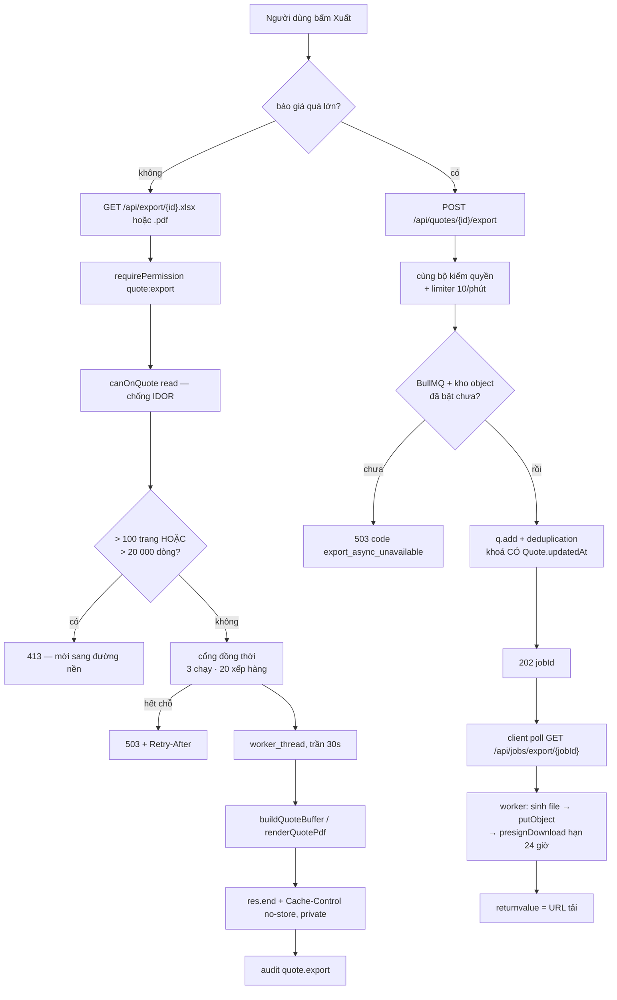
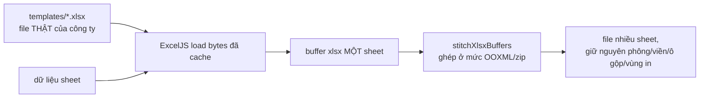

# Hai nhánh xuất file

Nguồn: `src/routes/export.routes.ts` (đồng bộ), `src/routes/jobs.routes.ts`
(nền), `src/exportQueue.ts` (cổng đồng thời + worker thread), `src/worker.ts`
(tiến trình worker), `src/excel.ts` + `src/xlsxStitcher.ts`, `src/pdf.ts`.
Diễn giải bằng lời: [DATA_FLOW.md](../DATA_FLOW.md#4-đường-xuất-excelpdf).

## Bốn chốt dễ bị bỏ khi sửa đường này

**`quote:export` là NĂNG LỰC RIÊNG, không suy ra từ quyền đọc.** `account_hn`
có `quote:read:own` vì được thêm làm thành viên báo giá được giao. Bỏ
`requirePermission` thì tài khoản chỉ được thấy bảng Hà Nội lại tải về được
toàn bộ bảng giá gửi khách. Cả hai nhánh đều phải có cổng này — nhánh nền từng
là chỗ dễ quên vì nó nằm ở router khác.

**`Cache-Control: no-store, private`.** Cloudflare cache theo đuôi `.xlsx`. Thiếu
header này thì file của người này được phục vụ cho người khác.

**Hai tín hiệu huỷ, không phải một.** `res` phát `close` khi khách đóng tab; và
một hạn chót 60 giây cho socket chết mà **không gửi FIN** — chuyện thường qua
tunnel/NAT, và trong ca đó sự kiện `close` không bao giờ tới. Chỉ dựa vào sự
kiện thì một suất trong trần 3 bị giữ vô thời hạn, người còn ở lại chờ lâu hơn
hoặc bị 503 oan. Dùng `res` chứ không dùng `req`: với một GET không thân, luồng
`req` được tiêu thụ xong ngay nên nó có thể phát `close` khi kết nối vẫn sống.

**`Quote.updatedAt` nằm TRONG khoá gộp.** Đã đo trên bullmq 5.77.6:
`moveToFinished` chỉ xoá khoá `de:` khi `PTTL` là 0 hoặc -1, nên với TTL dương
thì khoá **sống sót** qua lúc job hoàn tất. Không có mốc sửa đổi trong khoá thì
trong 30 giây sau khi xuất xong, một lượt xuất lại hợp lệ (người dùng vừa sửa
báo giá) bị gộp vào job cũ và nhận **đúng file cũ**.

## Vì sao ghép ở mức zip

Chép ô-qua-ô giữa hai workbook làm mất phông, theme, fill, viền và neo ảnh — tức
mất đúng thứ khiến file trông như file của công ty. Ghép ở mức zip giữ mỗi sheet
y như khi nó là sheet duy nhất.

**Bảng nội bộ không lọt vào Excel** không nhờ một bộ lọc: `src/excel.ts` chỉ đọc
`sheet.items`, còn `extraTables` **không xuất hiện trong file đó**. Đó là ràng
buộc nghiệp vụ cứng nhất của hệ, và cách bảo vệ nó tốt nhất là để đường xuất
không có cách nào chạm tới dữ liệu đó.
