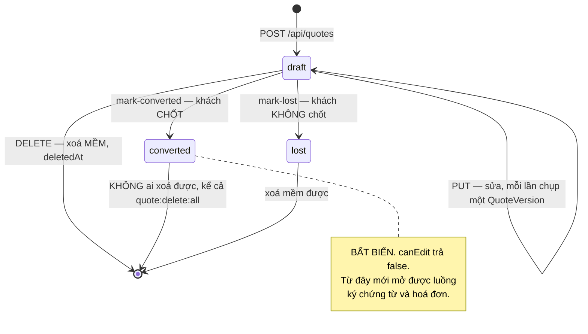
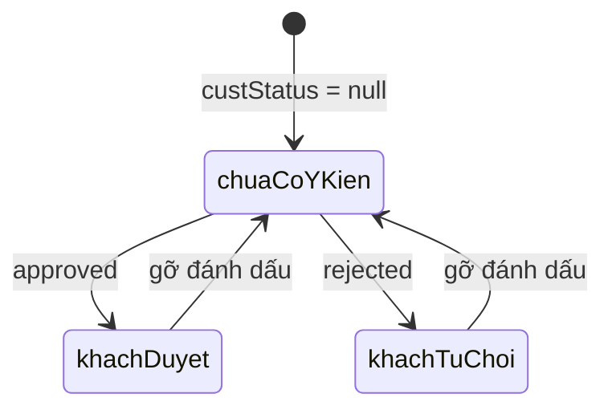
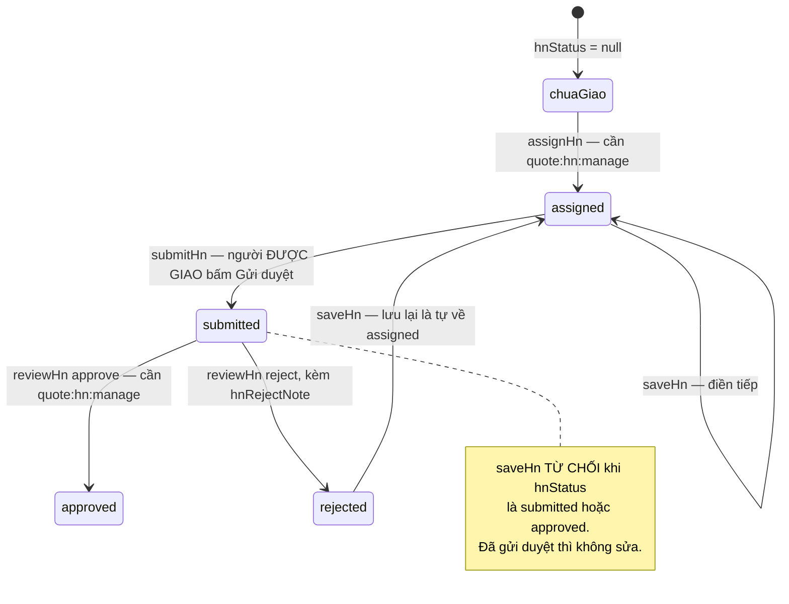

# Vòng đời báo giá

Nguồn: enum `QuoteStatus` trong `prisma/schema.prisma`, `canEdit` trong
`src/quoteUtils.ts`, `markConverted`/`markLost`/`deleteQuote` trong
`src/services/quoteService.ts`, `src/hnWorkflow.ts`.
Diễn giải đầy đủ (ai làm được gì): [QUOTE_WORKFLOW.md](../../product/QUOTE_WORKFLOW.md).

## Trạng thái báo giá — vòng đời ĐANG CHẠY

**Chỉ ba trạng thái được tạo ra bởi mã đang chạy**: `draft` (lúc tạo và lúc nhân
bản), `converted`, `lost`. Grep chuỗi `status: "` trong
`src/services/quoteService.ts` cho năm chỗ — hai chỗ ghi `draft` (tạo mới, nhân
bản), một chỗ `converted`, một chỗ `lost`, và một chỗ là **bộ lọc truy vấn**
(trang Quản lý dự án chỉ lấy báo giá `converted`). Không chỗ nào ghi
`pending`/`approved`/`rejected`/`sent`.

## Bốn trạng thái LEGACY

`pending` · `approved` · `rejected` · `sent` vẫn còn trong enum `QuoteStatus`,
vẫn có nhãn tiếng Việt trong `web/src/lib/format.tsx`, và `canEdit` vẫn xử lý
`rejected` — nhưng **không đường ghi nào đặt chúng nữa**. Luồng duyệt nội bộ
(`submitQuote`/`approveQuote`/`rejectQuote`) đã bỏ ngày 2026-06-22: "duyệt" thật
là quyết định của khách, không phải một cấp phê duyệt bên trong.

Chúng ở lại vì hai lý do, cả hai đều thực dụng:

* CSDL production còn hàng mang giá trị cũ. Bỏ khỏi enum là một migration đụng
  dữ liệu để đổi lấy đúng một dòng gọn hơn.
* `canEdit` và `deleteQuote` vẫn coi `rejected` như `draft`, nên hàng cũ vẫn sửa
  và xoá được bình thường.

Đừng viết mã mới đặt bốn trạng thái này. Nếu bạn thấy chúng trong dữ liệu, đó là
lịch sử, không phải luồng.

## Quyết định của khách — theo TỪNG SHEET, tách khỏi `status`

Một báo giá nhiều sheet: khách chốt sheet này mà chưa chốt sheet kia. Đó là
`QuoteSheet.custStatus`, hoàn toàn tách khỏi `Quote.status`.

`Quote.status` chỉ đổi khi **người phụ trách** bấm Chốt / Không chốt — cần quyền
`quote:send`. Đánh dấu ý kiến khách trên một sheet cũng cần `quote:send`, cộng
`canOnQuote(update)` trên chính báo giá đó.

## Luồng GIÁ HÀ NỘI — trục thứ ba, độc lập với hai trục trên

`Quote.hnStatus` là một chuỗi (không phải enum), sống song song với `Quote.status`.

Tiền Hà Nội nằm trong `QuoteSheet.extraTables` với `category` là `"hanoi"` — tức
là **nội bộ**, nên nó không bao giờ vào file Excel gửi khách (`src/excel.ts` chỉ
đọc `sheet.items`, không hề đụng `extraTables`).

Người điền phần HN bị chặn ở `PUT /api/quotes/:id` bằng một guard đặt **trước**
service: ai có `quote:hn:fill` thì nhận 403 ở đường lưu báo giá chính. Không có
guard đó, người này nhận editor chỉ có phần HN nhưng bấm Lưu là gửi payload
thiếu toàn bộ sheet báo giá chính và **xoá trắng báo giá**.
