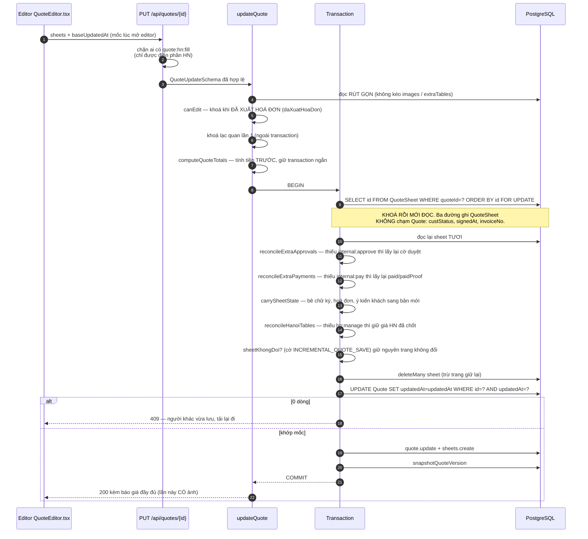
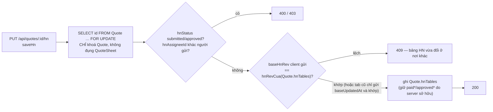

# Đường LƯU báo giá

Nguồn: `updateQuote` trong `src/services/quoteService.ts`, `saveHn` trong
`src/hnWorkflow.ts`, `carrySheetState`/`sanitizeExtraTables` trong
`src/quoteUtils.ts`.
Diễn giải bằng lời: [DATA_FLOW.md](../DATA_FLOW.md#3-đường-lưu-báo-giá).

Đây là đường **duy nhất trong hệ có thể làm mất công việc của người khác**. Mỗi
hộp dưới đây tồn tại vì một cách mất dữ liệu cụ thể, không phải vì gọn sơ đồ.

## Vì sao khoá lạc quan phải kiểm HAI lần

Lần kiểm đầu chạy **ngoài** transaction, nên hai người bấm Lưu chồng nhau vẫn
lọt qua **cả hai** (cùng đọc một mốc) rồi người ghi sau đè im lặng — `UPDATE`
không hề kèm điều kiện mốc. Câu `UPDATE … WHERE updatedAt = <mốc>` bên trong
transaction vừa **kiểm** vừa **khoá** hàng `Quote`: bên đến sau phải xếp hàng,
tới lượt thì mốc đã đổi → 0 dòng → 409.

Nó dùng `$executeRaw` chứ không dùng `tx.quote.updateMany` vì extension realtime
coi `updateMany` là WRITE: mỗi lần Lưu sẽ bắn **hai** sự kiện SSE thay vì một, và
một lần Lưu **thất bại** (rollback) vẫn bắt mọi client đang mở danh sách tải lại,
vì `emit` nằm ngoài vòng đời transaction.

## Vì sao `ORDER BY id`

`deleteMany` khoá theo thứ tự quét vật lý (không xác định). Thiếu `ORDER BY id`
thì `updateQuote` và `saveHn` có thể lấy khoá **ngược chiều nhau** trên cùng một
báo giá → deadlock 40P01 → Prisma P2034. Hai đường ghi `updateQuote` và
`markExtraTableRowPayment` lấy khoá `QuoteSheet` **trước** `Quote`, cùng một thứ tự. `saveHn` từ
2026-09-15 **chỉ** khoá hàng `Quote` và KHÔNG đụng `QuoteSheet` (xem nhánh dưới) — nên không có cặp
khoá ngược chiều nào với hai đường kia.

## Nhánh Account Hà Nội

Vẽ lại 2026-09-23 theo `src/hnWorkflow.ts` và DATA_FLOW.md mục 3.4 (audit DOC-10). Bản trước mô tả
mô hình CŨ (trước 2026-09-15): khoá `QuoteSheet`, suy đoán 409 theo `sheetId`, ghi bảng `category=hanoi`
trong `extraTables` của từng trang — mâu thuẫn với mã.

Khoá lạc quan theo **`hnRev`** — băm vân tay bảng Hà Nội, bỏ qua `paid*`/`approved*`/`paidProof`/`rid`
— nên chủ báo giá lưu thứ khác KHÔNG làm account HN ăn 409. `baseUpdatedAt` chỉ còn là đường tương
thích cho tab mở trước lần deploy đó.
