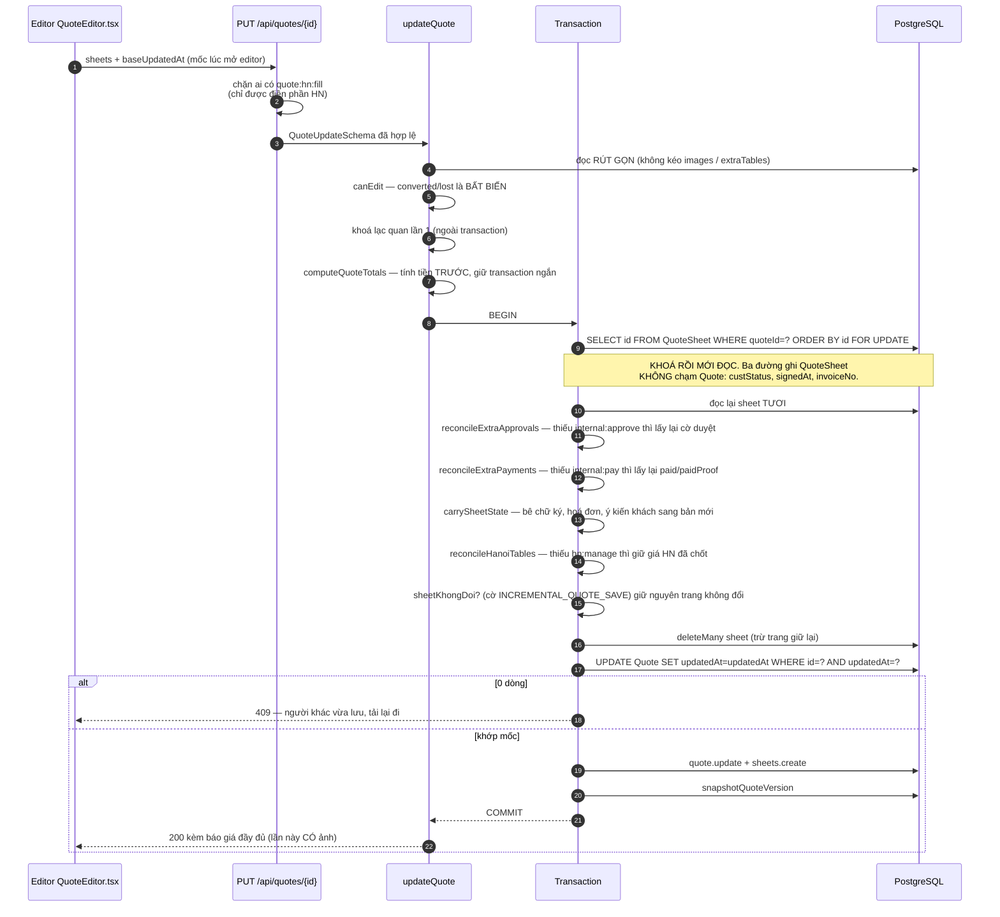
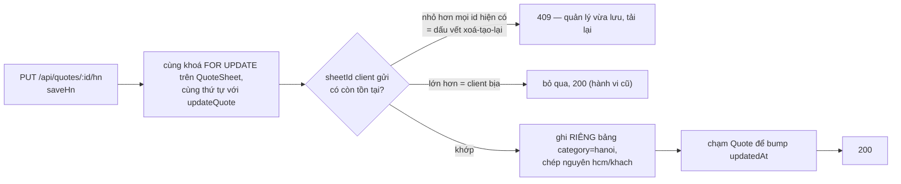

# Đường LƯU báo giá

Nguồn: `updateQuote` trong `src/services/quoteService.ts`, `saveHn` trong
`src/hnWorkflow.ts`, `carrySheetState`/`sanitizeExtraTables` trong
`src/quoteUtils.ts`.
Diễn giải bằng lời: [DATA_FLOW.md](../DATA_FLOW.md#3-đường-lưu-báo-giá).

Đây là đường **duy nhất trong hệ có thể làm mất công việc của người khác**. Mỗi
hộp dưới đây tồn tại vì một cách mất dữ liệu cụ thể, không phải vì gọn sơ đồ.

## Vì sao khoá lạc quan phải kiểm HAI lần

Lần kiểm đầu chạy **ngoài** transaction, nên hai người bấm Lưu chồng nhau vẫn
lọt qua **cả hai** (cùng đọc một mốc) rồi người ghi sau đè im lặng — `UPDATE`
không hề kèm điều kiện mốc. Câu `UPDATE … WHERE updatedAt = <mốc>` bên trong
transaction vừa **kiểm** vừa **khoá** hàng `Quote`: bên đến sau phải xếp hàng,
tới lượt thì mốc đã đổi → 0 dòng → 409.

Nó dùng `$executeRaw` chứ không dùng `tx.quote.updateMany` vì extension realtime
coi `updateMany` là WRITE: mỗi lần Lưu sẽ bắn **hai** sự kiện SSE thay vì một, và
một lần Lưu **thất bại** (rollback) vẫn bắt mọi client đang mở danh sách tải lại,
vì `emit` nằm ngoài vòng đời transaction.

## Vì sao `ORDER BY id`

`deleteMany` khoá theo thứ tự quét vật lý (không xác định). Thiếu `ORDER BY id`
thì `updateQuote` và `saveHn` có thể lấy khoá **ngược chiều nhau** trên cùng một
báo giá → deadlock 40P01 → Prisma P2034. Ba đường ghi
(`updateQuote`, `saveHn`, `markExtraTableRowPayment`) đều lấy khoá `QuoteSheet`
**trước** `Quote`, cùng một thứ tự.

## Nhánh Account Hà Nội

`BUMP` không phải trang trí: ghi bảng HN là ghi hàng **con**, nên `Quote.updatedAt`
không tự đổi. Không bump thì khoá lạc quan của quản lý không thấy phần HN vừa
lưu, và lần `deleteMany` + tạo lại kế tiếp ghi đè nó **im lặng**.

Nhánh `E409` là **suy đoán theo dấu vết**, và mã nguồn nói thẳng điều đó: id của
`QuoteSheet` tăng dần theo sequence, nên id nhỏ hơn mọi id hiện có gần như chắc
chắn là dấu vết xoá-tạo-lại. Hợp đồng đúng đắn cần client gửi `baseUpdatedAt`
cho cả đường này. Nhưng suy đoán này **không bao giờ làm mất dữ liệu**: sai thì
cùng lắm bắt tải lại một lần thừa.
