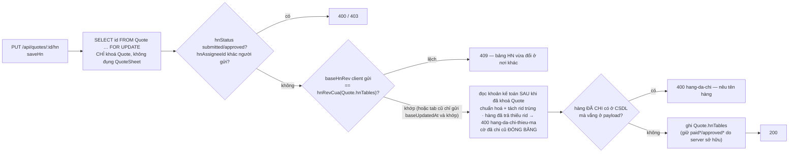

# Đường LƯU báo giá

Nguồn: `updateQuote` trong `src/services/quoteService.ts`, `saveHn` trong
`src/hnWorkflow.ts`, `carrySheetState`/`sanitizeExtraTables` trong
`src/quoteUtils.ts`.
Diễn giải bằng lời: [DATA_FLOW.md](../DATA_FLOW.md#3-đường-lưu-báo-giá).

Đây là đường **duy nhất trong hệ có thể làm mất công việc của người khác**. Mỗi
hộp dưới đây tồn tại vì một cách mất dữ liệu cụ thể, không phải vì gọn sơ đồ.

```mermaid
sequenceDiagram
    autonumber
    participant FE as Editor QuoteEditor.tsx
    participant RT as PUT /api/quotes/{id}
    participant SV as updateQuote
    participant TX as Transaction
    participant DB as PostgreSQL

    FE->>RT: sheets + baseUpdatedAt (mốc lúc mở editor)
    RT->>RT: chặn ai có quote:hn:fill<br/>(chỉ được điền phần HN)
    RT->>SV: QuoteUpdateSchema đã hợp lệ
    SV->>DB: đọc RÚT GỌN (không kéo images / extraTables)
    SV->>SV: canEdit — khoá khi ĐÃ XUẤT HOÁ ĐƠN (daXuatHoaDon)
    SV->>SV: khoá lạc quan lần 1 (ngoài transaction)
    SV->>SV: computeQuoteTotals — tính tiền TRƯỚC, giữ transaction ngắn

    SV->>TX: BEGIN
    TX->>DB: SELECT id FROM QuoteSheet WHERE quoteId=? ORDER BY id FOR UPDATE
    Note over TX,DB: KHOÁ RỒI MỚI ĐỌC. Ba đường ghi QuoteSheet<br/>KHÔNG chạm Quote: custStatus, signedAt, invoiceNo.
    TX->>DB: SELECT hnStatus, hnTables FROM Quote WHERE id=? FOR NO KEY UPDATE
    TX->>DB: đọc khoản kế toán (InputInvoiceEntry) của báo giá
    Note over TX,DB: KHOÁ Quote SỚM rồi mới đọc khoản (thứ tự vẫn QuoteSheet → Quote).<br/>Kế toán ghi khoản dưới Quote FOR SHARE — không chen vào được tới lúc commit.<br/>NO KEY: ghi chú danh sách / thành viên (kiểm FK) không phải chờ lần Lưu.
    TX->>DB: đọc lại sheet TƯƠI
    TX->>TX: chuanHoaRidTrung — rid TRÙNG có sẵn ở CSDL: bản sau nhận rid mới,<br/>bản payload ghép theo thứ tự với bản CSDL nó thay (mỗi hàng giữ cờ của chính nó)
    opt hàng đã trả (cờ JSON cũ) THIẾU rid
        TX-->>FE: 400 hang-da-chi-thieu-ma — lưu sẽ xoá im cờ + ảnh; quản trị chạy backfillKhoanChi --sua-rid
    end
    TX->>TX: tachRidTrung — rid trùng trong một phía thì hàng sau nhận rid mới
    TX->>TX: reconcileExtraApprovals — thiếu internal:approve thì lấy lại cờ duyệt
    TX->>TX: reconcileExtraPayments — cờ đã chi cũ ĐÓNG BĂNG theo CSDL cho mọi người
    TX->>TX: carrySheetState — bê chữ ký, hoá đơn, ý kiến khách sang bản mới
    TX->>TX: hangDaChiBiMat — hàng ĐÃ CHI có ở CSDL mà vắng ở payload?
    opt có (xoá hàng / bảng / trang đã chi)
        TX-->>FE: 400 hang-da-chi — nêu tên hàng, màn soạn giữ phần đang soạn
    end
    TX->>TX: hnTablesDeGhi — chotHnTables + cùng chuỗi trên cho Quote.hnTables TƯƠI
    TX->>TX: sheetKhongDoi? (cờ INCREMENTAL_QUOTE_SAVE) giữ nguyên trang không đổi
    TX->>DB: deleteMany sheet (trừ trang giữ lại)
    TX->>DB: UPDATE Quote SET updatedAt=updatedAt WHERE id=? AND updatedAt=?
    alt 0 dòng
        TX-->>FE: 409 — người khác vừa lưu, tải lại đi
    else khớp mốc
        TX->>DB: quote.update + sheets.create
        TX->>DB: snapshotQuoteVersion
        TX-->>SV: COMMIT
        SV-->>FE: 200 kèm báo giá đầy đủ (lần này CÓ ảnh)
    end
```

## Vì sao khoá lạc quan phải kiểm HAI lần

Lần kiểm đầu chạy **ngoài** transaction, nên hai người bấm Lưu chồng nhau vẫn
lọt qua **cả hai** (cùng đọc một mốc) rồi người ghi sau đè im lặng — `UPDATE`
không hề kèm điều kiện mốc. Câu `UPDATE … WHERE updatedAt = <mốc>` bên trong
transaction vừa **kiểm** vừa **khoá** hàng `Quote`: bên đến sau phải xếp hàng,
tới lượt thì mốc đã đổi → 0 dòng → 409.

Nó dùng `$executeRaw` chứ không dùng `tx.quote.updateMany` vì extension realtime
coi `updateMany` là WRITE: mỗi lần Lưu sẽ bắn **hai** sự kiện SSE thay vì một, và
một lần Lưu **thất bại** (rollback) vẫn bắt mọi client đang mở danh sách tải lại,
vì `emit` nằm ngoài vòng đời transaction.

## Vì sao `ORDER BY id`

`deleteMany` khoá theo thứ tự quét vật lý (không xác định). Thiếu `ORDER BY id`
thì `updateQuote` và `saveHn` có thể lấy khoá **ngược chiều nhau** trên cùng một
báo giá → deadlock 40P01 → Prisma P2034. Hai đường ghi `updateQuote` và
`ghiVungNoiBoDuocGiao` lấy khoá `QuoteSheet` **trước** `Quote`, cùng một thứ tự. `saveHn` từ
2026-09-15 **chỉ** khoá hàng `Quote` và KHÔNG đụng `QuoteSheet` (xem nhánh dưới) — nên không có cặp
khoá ngược chiều nào với hai đường kia.

Dịch vụ kế toán của trang Hóa đơn đầu vào (từ 2026-10-06, thay cho route `/pay` cũ — vốn cũng khoá
`QuoteSheet` → `Quote`) chỉ xin `Quote FOR SHARE` rồi khoá ĐÚNG khoản của nó, và **không bao giờ**
khoá `QuoteSheet`. Đường Lưu khoá `Quote FOR NO KEY UPDATE` rồi mới đọc khoản — hai chiều không bao giờ
ngược nhau, và đường Lưu không bao giờ GHI hai bảng khoản chi. Chi tiết:
[DATA_FLOW.md mục 3.5](../DATA_FLOW.md#35-ghi-khoản-chi-kế-toán--không-phải-đường-lưu-báo-giá).

## Nhánh Account Hà Nội

Vẽ lại 2026-09-23 theo `src/hnWorkflow.ts` và DATA_FLOW.md mục 3.4 (audit DOC-10). Bản trước mô tả
mô hình CŨ (trước 2026-09-15): khoá `QuoteSheet`, suy đoán 409 theo `sheetId`, ghi bảng `category=hanoi`
trong `extraTables` của từng trang — mâu thuẫn với mã.

```mermaid
flowchart LR
    A["PUT /api/quotes/:id/hn<br/>saveHn"] --> L["SELECT id FROM Quote … FOR UPDATE<br/>CHỈ khoá Quote, không đụng QuoteSheet"]
    L --> G{"hnStatus submitted/approved?<br/>hnAssigneeId khác người gửi?"}
    G -->|"có"| E4["400 / 403"]
    G -->|"không"| R{"baseHnRev client gửi<br/>== hnRevCua(Quote.hnTables)?"}
    R -->|"lệch"| E409["409 — bảng HN vừa đổi ở nơi khác"]
    R -->|"khớp (hoặc tab cũ chỉ gửi baseUpdatedAt và khớp)"| K["đọc khoản kế toán SAU khi đã khoá Quote<br/>chuẩn hoá + tách rid trùng · hàng đã trả thiếu rid → 400 hang-da-chi-thieu-ma<br/>cờ đã chi cũ ĐÓNG BĂNG"]
    K --> C{"hàng ĐÃ CHI có ở CSDL<br/>mà vắng ở payload?"}
    C -->|"có"| E400["400 hang-da-chi — nêu tên hàng"]
    C -->|"không"| W["ghi Quote.hnTables<br/>(giữ paid*/approved* do server sở hữu)"]
    W --> OK["200"]
```

Khoá lạc quan theo **`hnRev`** — băm vân tay bảng Hà Nội, bỏ qua `paid*`/`approved*`/`paidProof`/`rid`
— nên chủ báo giá lưu thứ khác KHÔNG làm account HN ăn 409. `baseUpdatedAt` chỉ còn là đường tương
thích cho tab mở trước lần deploy đó.
