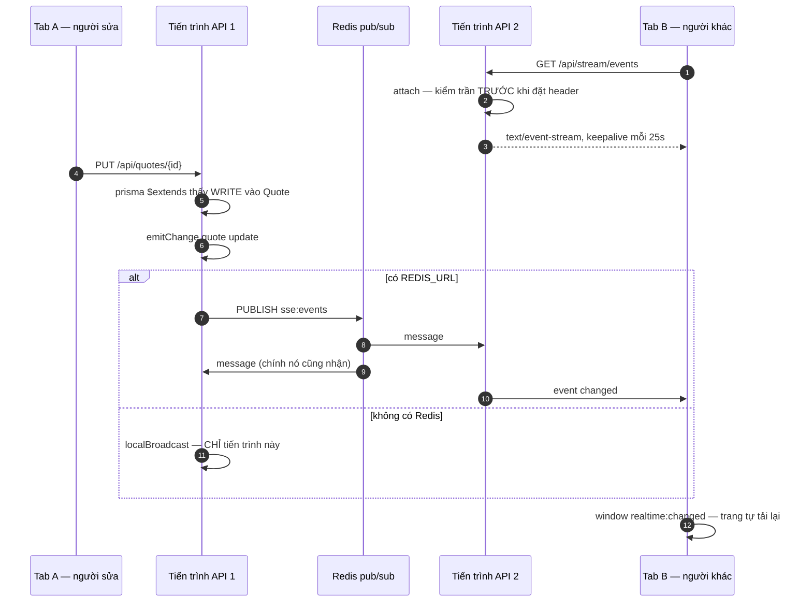
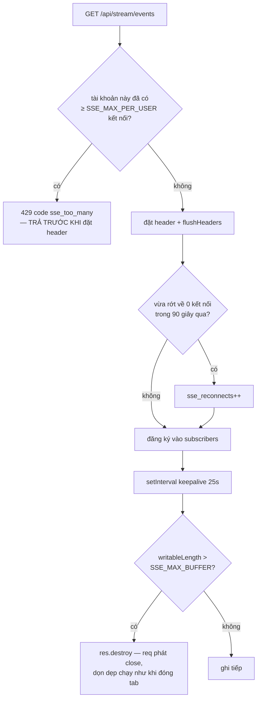

# Đường realtime (SSE)

Nguồn: `src/sse.ts`, `src/routes/stream.routes.ts`, extension realtime trong
`src/db.ts`, phía client là `web/src/components/Shell.tsx`.
Vì sao SSE chứ không phải WebSocket: [ADR 0004](../../adr/0004-sse-not-websocket.md).
Diễn giải bằng lời: [DATA_FLOW.md](../DATA_FLOW.md#2-đường-realtime-sse).

## Vì sao publish KHÔNG tự giao cục bộ khi có Redis

Mọi tiến trình đều **vừa** publish **vừa** subscribe cùng một kênh. Nếu publish
cũng giao thẳng xuống client của chính nó thì tab nối vào tiến trình đó nhận
**hai lần** mỗi sự kiện. Subscriber là nơi giao duy nhất; publish chỉ đẩy lên
kênh.

Publisher và subscriber dùng **hai bộ option khác nhau**:

| | `maxRetriesPerRequest` | `enableOfflineQueue` | vì sao |
|---|---|---|---|
| subscriber | `null` (vô hạn) | mặc định | kết nối dài, phải tự nối lại và chờ được |
| publisher | 2 | `false` | publish là bắn-và-quên trên đường xử lý request; Redis chết mà xếp hàng vô hạn thì hàng đợi offline phình trong bộ nhớ để rồi giao một sự kiện đã lỗi thời |

## Ba chốt chặn trong `attach`

**Kiểm trần trước khi đặt header** vì đã `flushHeaders` với `text/event-stream`
rồi thì không còn trả 429 được nữa.

**Áp lực ngược huỷ socket, không chỉ bỏ ghi.** Một client đọc chậm, hay một
socket đã chết mà không gửi FIN, làm mọi sự kiện tiếp theo dồn vào bộ đệm trong
tiến trình, không giới hạn. SSE là dữ liệu **gợi ý làm mới màn hình**: mất vài
sự kiện thì client tự re-fetch, còn phình bộ nhớ thì kéo sập cả app.

**`sse_reconnects` là suy luận, và mã nguồn nói thẳng điều đó.** `EventSource`
chỉ gửi `Last-Event-ID` khi máy chủ từng gửi trường `id:` — đường phát ở đây
không gửi bao giờ. Nên "nối lại" được suy ra từ việc tài khoản vừa rớt về không
kết nối trong `SSE_RECONNECT_WINDOW_MS` (mặc định 90 giây). Mở thêm tab thứ hai
không tính; người bỏ đi 10 phút rồi quay lại cũng không tính. Con số này đọc là
"đường realtime có đang **chập chờn** không", không phải "đếm tuyệt đối".

## Compression phải loại trừ SSE

`src/app.ts` khai `filter` riêng: `/api/stream/events` và mọi request có
`Accept: text/event-stream` đều không nén. Quyết định ở **thời điểm request** chứ
không đợi `Content-Type` — lúc filter chạy, header đáp có thể chưa được chốt.
Triệu chứng khi quên: "realtime lúc được lúc không".

## Presence

`POST /api/stream/presence` với `open` / `heartbeat` / `close`. Trạng thái sống
**trong bộ nhớ tiến trình**, không lưu CSDL — đóng hết tab là gỡ. Route kiểm
`canOnQuote(read)` trước khi ghi hoặc trả về danh sách; thiếu bước đó thì bất kỳ
ai đăng nhập cũng dò được `quoteId` bất kỳ để biết ai đang sửa và tên hiển thị
của họ.

## Tắt máy có kiểm soát

`closeAllSse` gửi sự kiện `shutdown` rồi đóng mọi kết nối. Cần nó vì
`server.close()` **chờ mọi kết nối đang mở kết thúc**, mà kết nối SSE theo thiết
kế thì không bao giờ kết thúc: callback không bao giờ chạy, tiến trình chỉ thoát
nhờ bộ đếm giờ cưỡng bức với mã thoát 1, và orchestrator đọc mã thoát đó là
"container hỏng". Mỗi lần deploy trở thành một lần tắt cứng.
