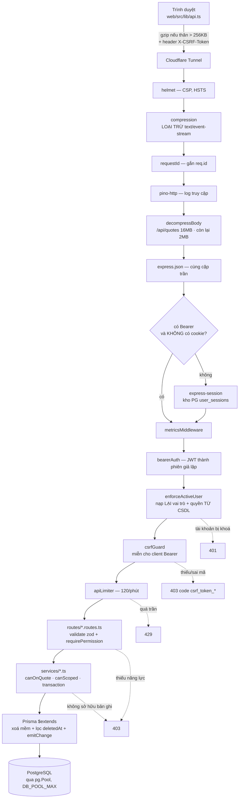

# Vòng đời một request

Nguồn: `src/app.ts` (thứ tự `app.use`), `src/middleware.ts`, `src/permissions.ts`.
Diễn giải bằng lời: [DATA_FLOW.md](../DATA_FLOW.md#1-một-request-thường-trình-duyệt--postgres).

## Ba điều dễ đọc nhầm

**Nhánh `SESS`.** Request mang Bearer mà **không** kèm cookie phiên thì bỏ qua
hẳn `express-session`. Không có nhánh này, `bearerAuth` ghi danh tính vào
`req.session` là đánh dấu phiên đã thay đổi → express-session lưu xuống PG và
phát `Set-Cookie` cho một client API chưa bao giờ xin cookie. Đã đo: 5 request
Bearer sinh 5 hàng `user_sessions` và 5 `Set-Cookie`.

**Hai lớp 403 khác nhau.** Ở route là **năng lực** ("được phép làm hành động
này không"); trong service là **phạm vi bản ghi** ("được phép làm nó trên bản
ghi cụ thể này không"). Bỏ lớp thứ hai là IDOR — bỏ lớp thứ nhất thì mọi tài
khoản đọc được một báo giá cũng xuất được nó.

**`notFound` đứng TRƯỚC static.** Nên `/api/gì-đó-không-có` trả 404 JSON thay vì
rơi vào vỏ SPA và trả về HTML — client `fetch` nhận HTML thay vì JSON là lớp lỗi
rất khó lần ra.
